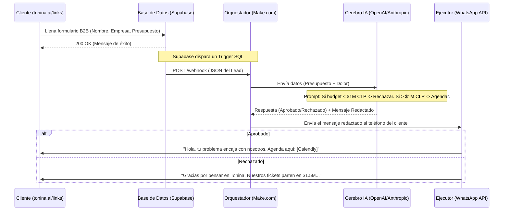

# Arquitectura Agéntica: Tonina B2B

Este documento mantiene el registro en código de los flujos automatizados de Tonina.
Puedes copiar y pegar estos bloques en herramientas como **Mermaid Live Editor** o directamente en el README de tu repositorio en GitHub para ver los diagramas generados.

## 1. El Bouncer (Triaje Comercial Autónomo)
*Estado: En construcción (Esperando Webhook de Make.com)*

